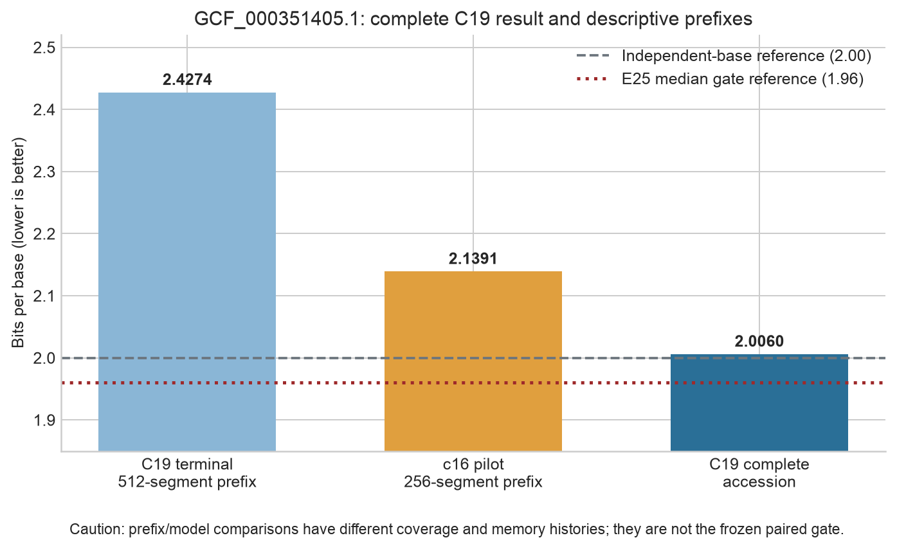
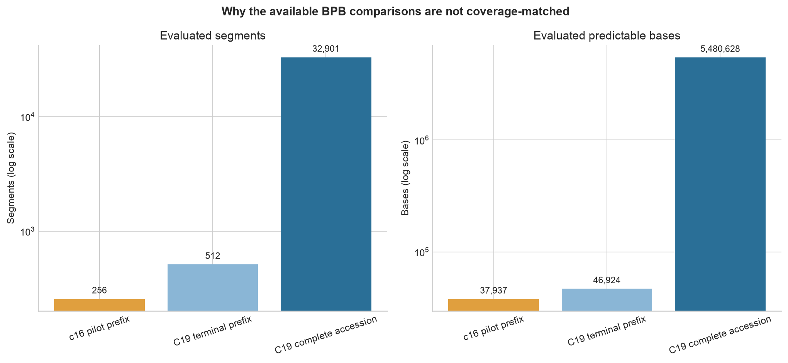
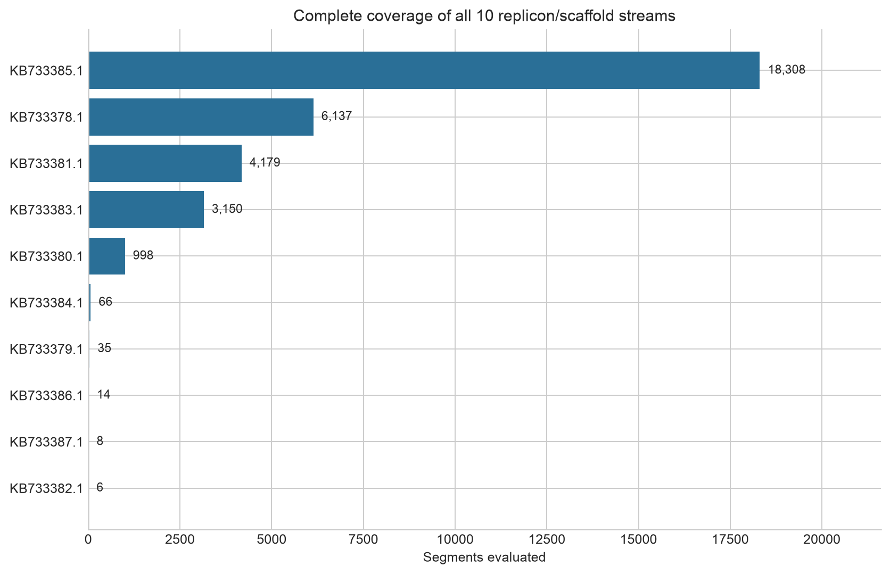

# 03m first completed accession — scientific report

## Bottom line

The first complete 03m held-out accession, `GCF_000351405.1`, obtained **2.006034 bits per base (BPB)** across all **32,901 segments**, **10 streams**, and **5,480,628 predictable bases**.

This is a valuable and much more representative result than the earlier 256- or 512-segment diagnostics. It shows that C19 can evaluate an entire held-out, ANI99-isolated assembly with finite execution and persistent per-stream adaptive memory. Its predictive result is mixed:

- it is 0.4214 BPB (17.36%) below C19's earlier 512-segment reading of 2.4274;
- it is descriptively 0.1331 BPB (6.22%) below the c16 256-segment pilot reading of 2.1391;
- it is still 0.0060 BPB above the 2.0 independent-base reference; and
- it is 0.0460 BPB above the protocol's 1.96 **median-across-eight-accessions** reference.

The first two improvements are not formal comparisons because coverage and memory history differ. The last point is not an individual-accession gate failure: the frozen threshold applies to the median of all eight accessions. The correct plan decision remains **HOLD E100 pending all eight accessions and the remaining memory/generation gates**.

## Accession and isolation

| Property | Value |
|---|---:|
| Accession | `GCF_000351405.1` |
| Validation ANI99 group | `ani99_000014` |
| Assembly level | Scaffold |
| Estimated completeness | 99.97% |
| Estimated contamination | 0.04% |
| GC fraction | 47.73% |
| Streams | 10 / 10 completed |
| Predictable bases | 5,480,628 |
| Segments | 32,901 |

Its ANI99 group was excluded from every training panel. This therefore measures held-out within-species generalization rather than memorization of a near-identical training representative under the study's declared split policy. However, it is one E. coli assembly and cannot support broader species or bacterial generalization.

## Prediction result

BPB is cross-entropy normalized by underlying DNA bases; lower is better. A value of 2 corresponds to assigning equal probability to the four canonical bases independently. C19's 2.0060 is extremely close to that reference but slightly worse, meaning its probability errors approximately cancel or outweigh the sequence regularities it captures when averaged over this entire accession.

This is not the same as saying the model learned nothing. Training BPB was below 2, the short and full held-out readings differ strongly, and memory remains active. It says that the current model has not yet demonstrated a net held-out compression advantage over the simple 2-bit reference on this accession. Calibration, distribution shift, stream composition, or unstable long-memory updates may be offsetting learned genomic structure.

The result is also above 1.96 by 0.0460 BPB. If every accession behaved this way, the prediction gate would fail. But with eight accessions, a single value above 1.96 does not determine the median. The full result requires all eight accession BPBs and their ordered median.

## Why the apparent improvements require caution

The available c16 value uses only 256 segments and 37,937 bases—about 0.69% of the bases in C19's complete-accession result. The earlier C19 diagnostic uses 512 segments and 46,924 bases—about 0.86%. They sample early stream prefixes, whereas the complete result averages ten independently reset streams of very different lengths.

Therefore:

- the 6.22% descriptive reduction versus c16 is encouraging but cannot satisfy the registered `>=0.02 BPB` baseline-improvement criterion;
- the 17.36% reduction versus C19's own short diagnostic suggests that the early prefix was unusually difficult or that longer sequential context helped, but those explanations are confounded; and
- no uncertainty interval can be reconstructed because the exported checkpoint stores accession-level NLL and base totals, not segment-level losses.

The required comparison is C19 and c16 evaluated over the same complete work plan. That full c16 artifact is still missing.

## Coverage anatomy

The complete accession result is dominated by `NZ_KB733385.1` (18,308 segments), followed by `NZ_KB733378.1` (6,137), `NZ_KB733381.1` (4,179), and `NZ_KB733383.1` (3,150). Several scaffolds contain only 6–66 segments. Memory is reset between streams, as required by the protocol; the result does not incorrectly concatenate scaffolds into one artificial chromosome.

This uneven stream size explains why a short fixed-segment prefix is not representative of the full assembly. It also means the accession aggregate is driven principally by four long streams. The current evaluator does not export per-stream BPB, so we cannot determine whether the final 2.0060 is uniform or hides strong successes and failures between scaffolds.

## Memory and numerical interpretation

No accession-specific memory diagnostic totals are stored in the evaluation checkpoint. The current checkpoint has already accumulated part of accession two, so its retrieval, update, surprise, drift, accuracy, and maximum-gradient fields cannot be attributed exactly to accession one.

What can be said safely is:

1. all ten streams completed without a nonfinite failure;
2. the evaluator advanced to accession two and preserved a resumable cursor;
3. the run-wide memory telemetry became extremely large during this early portion of evaluation; and
4. zero intervention does not imply gentle gradients because the exact recurrence has no configured memory-gradient limiter.

The previous interim audit found very large long-horizon diagnostics. Those remain a concern, but claiming that a particular maximum occurred within this accession would require a trace with stream/coordinate attribution. This is an important missing diagnostic, not grounds to invent precision from aggregate counters.

## Scientific contribution

This completed accession advances the project in three concrete ways.

First, it replaces a misleading short-prefix warning with a full-assembly endpoint. The earlier 2.4274 BPB did not characterize the whole accession; the complete value is 2.0060.

Second, it demonstrates operational long-context evaluation across a fragmented held-out assembly under correct stream boundaries. That is evidence that the C19 architecture and resumable evaluator can traverse millions of unseen bases without a terminal numerical failure.

Third, it sharpens the scientific question. The model is close to, but not below, the 2-bit reference on the first accession. The key issue is no longer simply whether the model runs; it is whether performance generalizes consistently across ANI99-separated accessions and whether adaptive memory provides useful context rather than numerically active but poorly calibrated state changes.

It does **not** yet demonstrate adaptive-memory benefit, successful key/value association, biological function, generation quality, anomaly detection, or E. coli-wide generalization.

## Impact on the E100 plan

The result is **neither an E100 authorization nor a reason to abandon C19**.

Positive implications:

- the catastrophic-looking 512-segment BPB was not representative of the complete accession;
- one full held-out assembly completed successfully; and
- C19 is descriptively better than the available c16 prefix on this accession.

Negative implications:

- C19 did not beat the 2-bit reference on accession one;
- this accession is above the 1.96 median target;
- only 1/8 validation accessions is complete; and
- the matched full c16 baseline, controlled memory test, generation evaluation, and compiled gate are absent.

The frozen prediction gate additionally requires mean C19 improvement over full c16 of at least 0.02 BPB, paired-bootstrap upper 95% bound below zero, and at least six of eight accessions improving. None can be computed from this result alone.

## Next steps

1. Continue 03m unchanged until all eight accessions complete; preserve exact resume artifacts.
2. Report each newly completed accession BPB rather than interpreting partial-accession aggregates.
3. Complete the full c16 evaluation over the identical panel and work plan. Do not use the 256-segment pilot for the gate.
4. After the prediction evaluation, run the declared 64-pair memory behavior test, memory trace, and matched generation stage.
5. Add an explicitly exploratory stream-level diagnostic that records BPB and memory-gradient maxima by stream and coordinate. Do not change the frozen gate or C19 result.
6. Proceed to E100 only if the final frozen `scale_gate.json` records `proceed: true` and the numerical-conditioning review is acceptable.

## Evidence limitations

The exact accession NLL, bases, segment count, and work plan are durable accumulator fields. Accuracy and memory telemetry are only stored as run-wide aggregates and are intentionally not reported as accession-specific. The c16 and terminal C19 comparisons are labeled descriptive because their coverage differs by more than two orders of magnitude.

