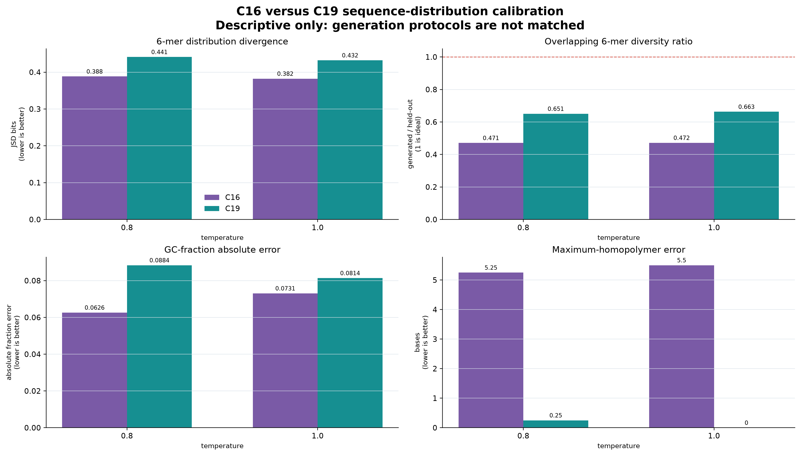
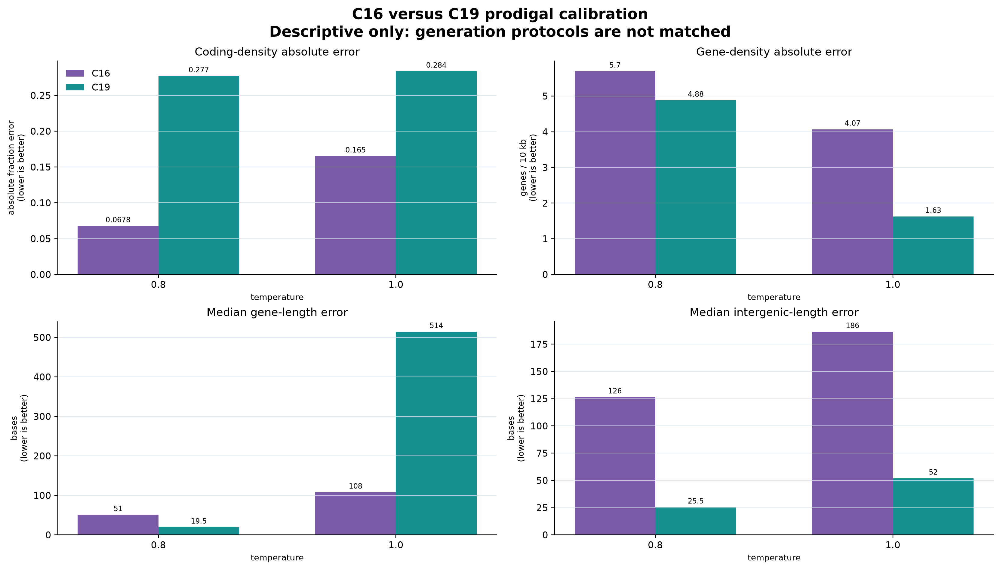

# Stage C C19 generation-capability review

Review date: 2026-08-07  
Checkpoint: optimizer step 26,250; 15,120,000 processed bases  
Checkpoint SHA-256: `e08d96cab9808b45a8972e36f0f50fcf5754e012565c35f685b0d555f3da8b4f`

## Executive decision

**C19 is operationally ready for a matched generative evaluation, but the completed 03p run does not yet demonstrate that it has surpassed C16.**

The positive engineering result is strong: the checkpoint loaded, all 12 requested continuations were generated on the A100, every reported number was finite, no ambiguous bases were emitted, neural-memory telemetry was present, and Prodigal completed. The result is therefore a valid smoke assessment rather than another infrastructure failure.

The scientific result is mixed and remains exploratory. C19 has substantially less homopolymer pathology and greater observed 6-mer variety than the supplied C16 output. However, C19 is farther from the held-out sequence distribution by 6-mer Jensen–Shannon divergence (JSD), remains too GC-rich, and has excessively high predicted coding density. Its aligned 6-mer diversity is only 45–50% of the equal-length held-out reference. This is evidence of incomplete distributional calibration, not evidence of mature genome generation.

Most importantly, the supplied C16 and C19 reports were produced with different prompt lengths, continuation lengths, seeds, and temperature grids. Their shared-temperature results are useful for forming hypotheses, but **they are not an admissible model-improvement comparison and cannot pass or fail the frozen E25 generation gate**.

## What notebook 03p completed

The notebook evaluated the uploaded `latest.pt` against the frozen validation data identity:

- dataset fingerprint: `2fbdb870606e6fb1ce0f6750524726d041474be5081da2cb2316948bc12a2ee9`;
- taxonomy-manifest SHA-256: `5b7c8b1136ac31972ee8d2ca615c798fdcec38a1d4c57f986892c88af3eb301a`;
- split/species: validation / *Escherichia coli*;
- four held-out prompt accessions;
- 128 prompt tokens and 256 new tokens (1,536 generated bases per continuation);
- temperatures 0.6, 0.8, and 1.0, with top-k 128 and top-p 0.95;
- seed 20260751 and adaptive neural memory;
- sequence statistics, 1–6-mer divergence, heuristic ORF diagnostics, neural-memory traces, and Prodigal calls.

The notebook classified the result as `SMOKE_FINITE_WITH_CALIBRATION_WARNING`. That label is appropriate: execution succeeded, while the generated distribution remains outside the exploratory calibration bands.

## C19 standalone result

| Temperature | 6-mer JSD ↓ | Aligned 6-mer diversity / reference | GC error ↓ | Entropy error ↓ | Prodigal coding density | Predicted genes / 10 kb |
|---:|---:|---:|---:|---:|---:|---:|
| 0.6 | 0.4599 | 0.451 | 0.1077 | 0.0266 | 0.933 | 13.02 |
| 0.8 | 0.4413 | 0.503 | 0.0884 | 0.0186 | 0.920 | 13.02 |
| 1.0 | **0.4322** | 0.451 | **0.0814** | **0.0094** | 0.926 | 9.77 |
| Held-out reference | 0 | 1.000 | 0 | 0 | 0.643 | 8.14 |

Temperature 1.0 best matches global base composition and the 6-mer distribution within this small smoke run. Temperature 0.8 retains the most aligned 6-mer diversity and has a much more plausible median predicted gene length (526.5 bases versus 507 in the reference). Neither setting is calibrated well enough to freeze as a deployment policy: all three exceed the 0.05 exploratory GC-error level and all three fall well below the 0.80 exploratory aligned-diversity lower bound.

C19's generated GC fractions are 0.580–0.606 versus 0.498 in the matched reference. Prodigal assigns 0.920–0.933 of generated bases to coding regions versus 0.643 for the reference. This suggests the generator is producing a narrow, GC-rich, coding-like regime. It is not enough to infer real genes: Prodigal detects open reading patterns, not expression, protein function, viability, or biological safety.

The notebook's native plots are available as [GC calibration](c19_smoke_generation_gc.svg) and [k-mer JSD](c19_smoke_generation_kmer_jsd.svg).

## Descriptive C16 versus C19 comparison



At the two shared temperatures, C19 looks better on overlapping 6-mer variety and maximum-homopolymer length, but worse on 6-mer JSD and GC calibration:

| Metric | Temperature | C16 | C19 | Descriptive direction |
|---|---:|---:|---:|---|
| 6-mer JSD | 0.8 | **0.388** | 0.441 | C16 closer to reference |
| 6-mer JSD | 1.0 | **0.382** | 0.432 | C16 closer to reference |
| Overlapping 6-mer diversity / reference | 0.8 | 0.471 | **0.651** | C19 closer to 1 |
| Overlapping 6-mer diversity / reference | 1.0 | 0.472 | **0.663** | C19 closer to 1 |
| GC absolute error | 0.8 | **0.0626** | 0.0884 | C16 closer to reference |
| GC absolute error | 1.0 | **0.0731** | 0.0814 | C16 closer to reference |
| Homopolymer-length error | 0.8 | 5.25 | **0.25** | C19 much closer |
| Homopolymer-length error | 1.0 | 5.50 | **0.00** | C19 much closer |

The likely improvement is reduced repetitive collapse: C16 produces maximum homopolymers about 5.3–5.5 bases longer than its reference, whereas C19 matches this coarse statistic. C19's normalized overlapping 6-mer diversity is also about 0.18–0.19 closer to the ideal ratio of one. The likely regression is distributional fidelity: its 6-mer JSD is about 13–14% higher, and its GC error is higher at both shared temperatures.

These numbers must not be treated as a controlled effect size. C16 used 32 prompt tokens, 1,024 new tokens, seed 20260781, and temperatures 0.8/1.0/1.2. C19 used 128 prompt tokens, 256 new tokens, seed 20260751, and temperatures 0.6/0.8/1.0. Diversity and k-mer estimates depend on sequence length, and the prompt accessions also differ. Both runs contain only four prompts.



The Prodigal picture is likewise mixed. C19 is descriptively closer in gene density and intergenic length, and at temperature 0.8 its median predicted gene length is closer. Conversely, its coding-density error is much larger at both shared temperatures, and its temperature-1.0 median gene length is badly inflated (1,021.5 versus 507 reference bases). Because the C19 continuation is four times shorter, boundary truncation and a handful of calls can move these summaries substantially.

## Metric glossary and implications

| Metric | Meaning | Desired behavior | Implication here |
|---|---|---|---|
| Finite-output / no-N checks | Basic numerical and decoding validity | All finite; zero ambiguous-base fraction | Passed. The checkpoint and generation code are usable. |
| Base entropy | Balance of A/C/G/T, maximum 2 bits | Generated-reference error near zero, without trivial noise | C19 improves as temperature rises; 1.0 is close on this coarse measure. |
| GC fraction | Fraction of G or C bases | Generated-reference error near zero | Failed exploratory calibration at every C19 temperature; output is GC-rich. |
| Maximum homopolymer | Longest single-base repeat | Similar to held-out reference | C19 is well behaved; supplied C16 shows a repetition defect. |
| 6-mer JSD | Divergence between generated and held-out 6-mer distributions | Lower is better; zero means identical distributions | C19 remains far from reference and is descriptively worse than the unmatched C16 run. |
| Aligned unique-6-mer ratio | Position-budget-aligned local variety relative to reference | Near 1; frozen gate requires 0.95–1.05 | C19 is 0.451–0.503, showing substantial local-pattern collapse. |
| Heuristic ORFs | Six-frame stop-to-stop segments at least 90 bp | Diagnostic similarity only | C19 emits fewer ORFs than reference; this is not a functional annotation. |
| Prodigal coding density | Fraction assigned to predicted coding regions | Similar to held-out reference | C19 is severely overcalled (about 0.92 versus 0.64). |
| Genes / 10 kb | Density of Prodigal gene calls | Similar to held-out reference | Temperature 1.0 is closest, but the sample is small. |
| Gene/intergenic lengths | Coarse organization of predicted coding and noncoding segments | Similar distributions, not merely similar medians | Temperature 0.8 is the least implausible C19 compromise; full-length sampling is needed. |
| Memory telemetry | Update, retrieval, surprise, and state-drift activity during decoding | Finite and nonzero, then verified by controlled probes | Present and active; does not by itself prove useful memory. |

## Scientific opinion

The evidence supports **operational advancement** from C16 to C19: a much larger, later checkpoint can now be loaded and sampled reproducibly, its neural memory stays numerically active, and it avoids the conspicuous long-homopolymer failure seen in the supplied C16 output.

It does **not yet support a scientific claim of improved generation capability**. C19 appears to have traded one failure mode—repetitive low-variety output—for another: a narrower GC-rich and over-coding sequence regime. The higher local variety is encouraging because it is a prerequisite for useful generation, but the worse high-order k-mer match means the additional variety is not yet distributed like held-out *E. coli*. This is exactly why no single metric should be promoted to a quality score.

The current sample is also too small for uncertainty estimates. Four prompts can expose gross collapse, but they cannot establish robustness across accessions or distinguish checkpoint quality from decoder variance. The proper conclusion is: **promising mechanical progress, unresolved generative calibration, controlled comparison still pending**.

## Implications for the plan

1. **Do not authorize E100 from this result.** Generation is only one component of the frozen scale gate, and this smoke run does not evaluate that component under the registered protocol.
2. **Run the full C19 comparison in 03p.** Set `RUN_FULL=True`; this uses four prompts, 128 prompt tokens, 1,024 new tokens, temperature 0.6, top-k 1,024, top-p 0.99, and seed 20260781.
3. **Supply the correct frozen C16 v3 report.** Use `c17_v3_c16_broad_baseline_resumable/generation_t0p6/generation_evaluation.json` (or regenerate it with exactly the same identity and decoding fields). The currently supplied legacy C16 JSON is intentionally rejected as non-comparable.
4. **Apply the preregistered generation rule only to those matched reports.** C19 must have aligned 6-mer diversity ratio 0.95–1.05, at least 10% lower 6-mer JSD than C16, lower GC error than C16, and improvement in at least three registered metric families.
5. **Complete the other E25 gates.** The candidate must also satisfy the frozen held-out prediction criteria (median accession BPB ≤1.96, mean improvement ≥0.02 BPB, paired-bootstrap upper 95% bound below zero, and at least 75% of accessions improved) and the memory criteria (positive immediate and delayed behavior in at least 10 blocks each, with zero gradient-intervention fraction).
6. **If the matched generation gate fails, stop scaling and diagnose.** First inspect prompt-level distributions and decoding sensitivity around the frozen policy. If the GC-rich/high-coding mode persists across prompts, prioritize data mixture, context/exposure, or objective calibration; do not assume that more parameters or more sampling temperature will repair it.

## Provenance and reproducibility

The review bundle preserves the [C19 smoke report](c19_smoke_generation_evaluation.json), [supplied C16 report](c16_supplied_generation_evaluation.json), [03p status JSON](c19_generative_status.json), and [machine-readable descriptive comparison](descriptive_comparison.json). Source hashes and protocol differences are recorded in the comparison JSON. The figures and derived JSON can be regenerated with:

```bash
.venv/bin/python docs/titans_stage_c/analyze_c19_generation_comparison.py \
  --c16 artifacts/stage_c_c19_generation_review_20260807/c16_supplied_generation_evaluation.json \
  --c19 artifacts/stage_c_c19_generation_review_20260807/c19_smoke_generation_evaluation.json \
  --output-dir artifacts/stage_c_c19_generation_review_20260807
```

This assessment concerns conditional sequence statistics only. It makes no claim about biological function, expression, viability, pathogenicity, fitness, or safety.
