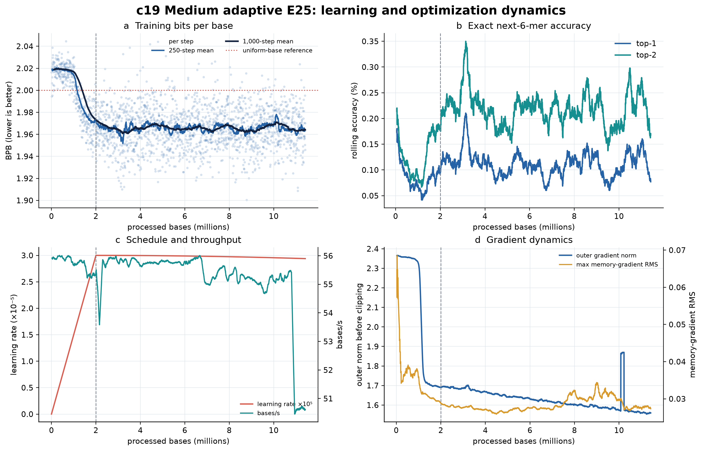
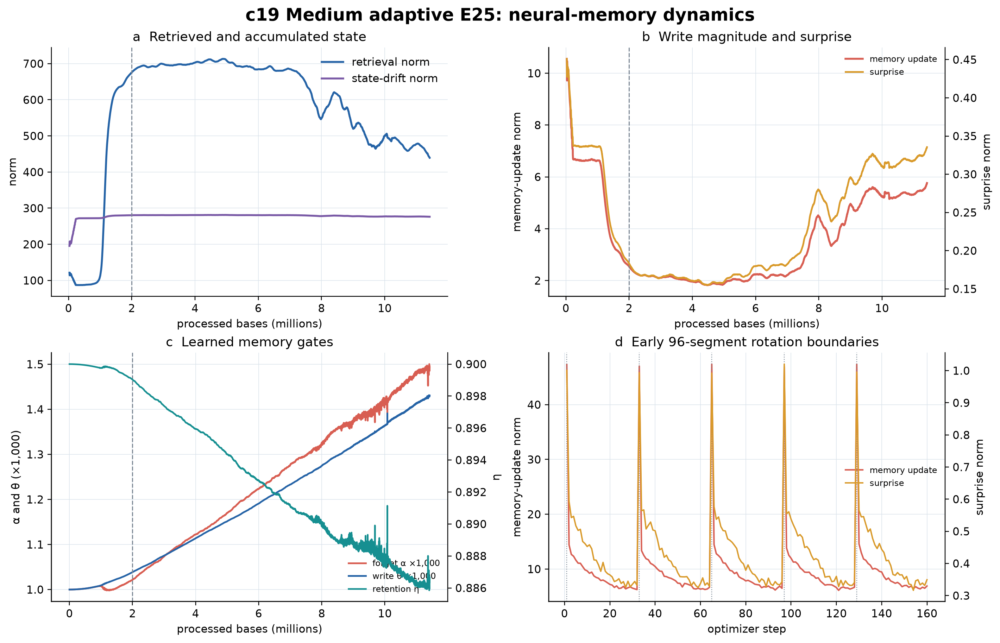

# C19 cumulative training briefing — 5 August 2026 snapshot

## Executive assessment

C19 is running correctly and resuming correctly. At the Drive snapshot time
(`2026-08-05T23:32:35Z`), the history contained 19,828 unique optimizer steps and
11,420,928 processed bases, or approximately 43.82% of the 26,062,903-base E25
panel. All recorded numeric values are finite. Neither neural-memory gradient
conditioning nor the legacy surprise limiter has activated.

The model has learned a clear training-distribution signal: its 500-step mean
improved from 2.0194 BPB during the first 500 steps to 1.9652 BPB in the latest
500. However, training BPB has been approximately flat since 2 million bases.
The best 500-step interval remains 1.9563 BPB, ending at 3,212,928 bases; the
additional data have not yet produced a sustained new training-BPB minimum.
This is compatible with learning under a changing accession mixture, but only
held-out validation can establish generalization.

## Snapshot and operational status

| Item | Cumulative value |
|---|---:|
| Optimizer steps | 19,828 |
| Processed bases | 11,420,928 |
| E25 panel progress | 43.82% |
| Recorded GPU time | 57.44 h |
| Recent throughput, latest 500 steps | 50.65 bases/s |
| Estimated remaining GPU time at recent speed | 80.30 h |
| Current learning rate | 2.9389 × 10⁻⁵ |
| Latest 500-step training BPB | 1.9652 |
| Best 500-step training BPB | 1.9563 |
| Finite telemetry | 100% |
| Memory safety interventions | 0 |

The run uses an NVIDIA A100-SXM4-40GB, PyTorch 2.11.0+cu128, CUDA 12.8, and
clean code commit `ae72fae21ff9a0b50e4fe1d9d642c38c643b4923`. The manifest
contains one obsolete pre-training seed-conflict failure, six subsequently
interrupted invocations, and one active invocation. The uninterrupted history
across those invocations demonstrates that checkpoint resume is preserving the
training trajectory. `FAILED.txt` refers to the corrected initial seed mismatch,
not the current run.

Relative to the prior review boundary at 5,919,552 bases, this snapshot adds
5,501,376 bases, 9,551 optimizer steps, and approximately 27.92 recorded GPU
hours. The new data preserve the BPB plateau and reveal the later shift from
large retrievals toward larger, more surprising memory writes.

## Learning and optimization metrics

**Bits per base (BPB).** BPB is the nucleotide-normalized negative log-likelihood;
lower is better. A uniform four-base predictor is 2 BPB. Median BPB was 2.0049
over 0–2 M bases, then 1.9645, 1.9658, 1.9654, 1.9651, and 1.9646 in successive
2 M-base windows (the last window ends at 11.421 M). The early improvement is
real training progress. The later plateau means more exposure is not presently
lowering average training cross-entropy, although panel composition can obscure
within-accession improvement.

**Exact next-6-mer accuracy.** The latest rolling top-1 and top-2 values are
0.0771% and 0.1688%. These exceed uniform guesses over 4,096 canonical 6-mers
(approximately 0.0244% and 0.0488%), but remain low and vary with sequence
composition. BPB uses the whole probability distribution and is the more useful
learning metric.

**Outer gradient norm.** Its latest 500-step mean is 1.558 before the configured
global 0.5 clipping operation. The long-term trend is downward, not explosive.
A short, finite event at steps 17,499–17,501 (approximately 10.080 M bases)
raised BPB to 2.4387 and 2.6114 and the pre-clipping norm to 26.38 and 46.62;
the next step returned to 1.9344 BPB and a norm of 3.76. This looks like a hard
segment or stream transition and was operationally contained, but the history
does not include an accession identifier, so its biological source cannot be
assigned. Recurrent or growing events would be concerning; this isolated,
self-resolving event is not evidence of divergence.

**Throughput.** Typical throughput remains about 55 bases/s, but the latest
500-step mean is 50.65 bases/s, roughly 9% lower. This affects cost and ETA, not
the scientific quality of the learned model. It should be rechecked after the
next resume before treating it as a persistent regression.

## Neural-memory metrics

| Metric | 2–4 M median | 4–6 M median | 8–10 M median | 10–11.421 M median | Latest 500 mean |
|---|---:|---:|---:|---:|---:|
| Retrieval norm | 695.93 | 702.51 | 533.72 | 473.63 | 449.77 |
| Memory-update norm | 2.10 | 1.93 | 4.70 | 5.34 | 5.62 |
| Surprise norm | 0.166 | 0.163 | 0.288 | 0.317 | 0.330 |
| State-drift norm | 280.72 | 280.93 | 277.84 | 276.89 | 276.43 |
| Raw memory-gradient RMS | 0.0274 | 0.0265 | 0.0291 | 0.0268 | 0.0277 |

**Retrieval norm** measures the magnitude retrieved from neural memory.
**Memory-update norm** measures how much the fast memory is rewritten.
**Surprise norm** measures the magnitude of the associative-loss gradient that
drives the write. **State-drift norm** measures accumulated fast-state movement.
Their absolute scales are architecture-dependent, so trends and matched controls
are more informative than isolated values.

After roughly 7–8 M bases, retrieval magnitude declines while write magnitude
and surprise increase, yet BPB stays flat. Simultaneously, mean forgetting
`alpha` rises from about 0.0010 to 0.00149, mean write strength `theta` rises to
0.00142, and momentum retention `eta` falls from 0.900 to about 0.886. Under a
constant mean-gate approximation, the forgetting half-life shortens from about
693 to 466 inner writes, while the surprise-momentum half-life shortens from
about 6.58 to 5.74 writes. Thus, the learned memory is becoming more plastic and
less persistent. This is coherent with lower retrieval and larger updates.

The behavior is interesting because it is structured and finite, rather than a
simple scale explosion. It could mean that later accessions require more frequent
memory rewriting, or that the model has learned a shorter useful memory timescale.
It does **not** yet show that memory improves prediction. The training history
lacks per-step accession/stream labels, so data-composition changes cannot be
separated from a learned memory-policy change.

The latest mean cosine between accumulated and momentary surprise is −0.0029,
effectively orthogonal. Current associative gradients therefore do not, on
average, reinforce the accumulated surprise direction. This may be expected for
diverse contexts, but it is not by itself a quality score.

## What this snapshot supports

- The medium paper-deep adaptive model trains and resumes on the E25 panel without
  non-finite failure through 11.42 M bases.
- It has learned non-uniform local DNA sequence statistics, as shown by the BPB
  improvement and above-uniform exact-token accuracy.
- Neural memory is active, its gates are learning, and its dynamics remain finite
  without invoking optional conditioning.
- Memory behavior changes systematically later in the panel, providing a useful
  hypothesis for accession-aware trace analysis.

## What this snapshot does not support

- It does not establish held-out generalization; these are training metrics.
- It does not establish an adaptive-memory advantage without a matched no-memory
  control and uncertainty analysis.
- It does not establish genome-level organization, taxonomic representation,
  anomaly-detection utility, or biological functionality.
- The BPB plateau does not prove that learning has stopped because the rotating
  panel changes sequence difficulty, but it does lower the expectation that panel
  completion alone will cause a large training-BPB improvement.

## Recommended decision point

Let C19 finish the required E25 panel unless instability begins to recur. At the
next analysis point, run held-out validation with fixed examples and preserve
per-accession/per-stream identifiers. Compare validation BPB with the earlier
checkpoint near the best training window (approximately 3.21 M bases), the final
checkpoint, and eventually a matched no-memory control. Also trace retrieval,
update, surprise, and gate statistics by accession. This will determine whether
the late memory-policy shift reflects useful adaptation, harder panel composition,
or unnecessary rewriting.

The machine-readable values and source-history SHA-256 are recorded in
`c19_snapshot_summary.json`. This package is a new cumulative snapshot and does
not replace the prior `artifacts/stage_c_c19_review` outputs.
