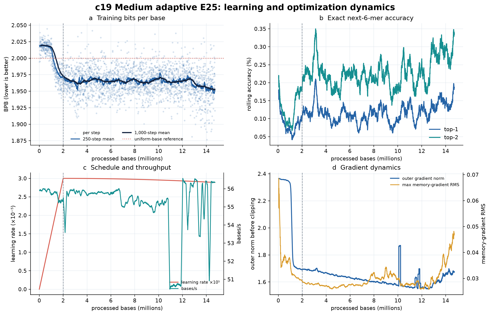
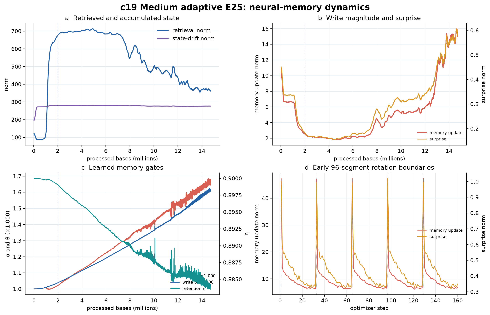

# C19 cumulative engineering and scientific review — 6 August 2026

## Bottom line

C19 is operationally healthy and is now showing renewed training progress. At
the downloaded Drive boundary, the deduplicated history contains 25,550
optimizer steps and 14,716,800 processed bases, equal to 56.46% of the fixed
26,062,903-base E25 panel. Every recorded numeric value is finite, checkpoint
resume has preserved a continuous trajectory across repeated Colab invocations,
and neither optional memory-gradient conditioning nor the legacy surprise cap
has activated.

The latest 500-step mean is 1.95050 bits per base (BPB), compared with 1.96522
in the 5 August snapshot and 2.01940 in the first 500 steps. The best 500-step
window is now 1.94921 BPB and ends at 14,679,936 bases, close to the current
checkpoint. This is stronger evidence of ongoing fit than the earlier plateau:
the gain is recent, sustained over hundreds of steps, and not just a single low
loss observation.

This remains training telemetry. It does not establish held-out generalization,
an advantage from adaptive memory, or biological function. The frozen E25 gate
still requires held-out accession BPB, paired uncertainty versus c16, controlled
memory probes, and comparative generation diagnostics.

## Cumulative snapshot

| Item | Value |
|---|---:|
| Optimizer steps | 25,550 |
| Processed bases | 14,716,800 |
| E25 completion | 56.46% |
| Recorded GPU time | 74.17 h |
| Recent throughput, latest 500 steps | 56.35 bases/s |
| Estimated remaining GPU time | 55.93 h |
| Current learning rate | 2.8894 x 10^-5 |
| First 500-step BPB | 2.01940 |
| Prior-snapshot latest 500-step BPB | 1.96522 |
| Current latest 500-step BPB | 1.95050 |
| Current best 500-step BPB | 1.94921 |
| Latest top-1 exact 6-mer accuracy | 0.1875% |
| Latest top-2 exact 6-mer accuracy | 0.3375% |
| Numeric telemetry finite | 100% |
| Memory safety interventions | 0 |

Since the 5 August review boundary, C19 added 5,722 optimizer steps, 3,295,872
bases, and 16.73 recorded GPU hours. The Drive status file was one optimizer
step behind the history file during synchronization; the analysis uses the
newer deduplicated history total and the status-derived fixed panel target.

## Machine-learning engineering review

### What is working well

- The run is reproducible at the environment level: clean repository commit
  `ae72fae21ff9a0b50e4fe1d9d642c38c643b4923`, A100-SXM4-40GB, CUDA 12.8,
  PyTorch 2.11.0+cu128, and a recorded command/configuration for every invocation.
- Exact resume is behaving as intended. One initial invocation failed before
  training because the seed was omitted; all later commands include seed
  `20260751`, and the cumulative optimizer/history trajectory has no duplicate
  or reset boundary after deduplication.
- All telemetry is finite. The configured global outer-gradient clip is 0.5;
  the latest 500-step pre-clip mean is 1.6695. There is no sustained explosion.
- Throughput recovered from 50.65 bases/s in the prior latest window to 56.35
  bases/s. At current speed, completion is approximately 56 GPU-hours away.
- The codebase contains a complete checkpoint-compatible generation workflow,
  dataset/checkpoint fingerprint checks, deterministic sampling tests, held-out
  prompt selection, reference continuations, k-mer/GC/diversity/ORF metrics,
  optional Prodigal analysis, and a frozen comparison gate.

### Engineering risks and monitoring

- `FAILED.txt` is stale and still present. It records the corrected first seed
  failure, not the active state. Operational dashboards should prefer
  `LIVE_STATUS.json` plus the final manifest step and archive or annotate stale
  failure markers after a successful resume.
- There have been eight post-failure invocations, seven interrupted/completed
  segments and one active segment. Resume correctness is good, but repeated
  runtime interruption increases operational overhead and makes file-sync races
  more likely.
- The latest memory-update mean is 15.21, up from 5.62 in the prior snapshot;
  surprise norm is 0.583, up from 0.330; and raw memory-gradient RMS is 0.0461,
  up from 0.0277. The most recent 2,000-step 99th percentiles are 28.88, 0.927,
  and 0.1048 respectively. These values remain finite and below early-run raw
  RMS transients, but the trend is steep enough to monitor at each checkpoint.
- Training history should add accession, stream, segment boundary, and resume
  invocation identifiers per step. Without them, distribution shifts cannot be
  separated cleanly from learned memory-policy changes.

Recommended alerting is trend-based: investigate if the 500-step raw
memory-gradient RMS doubles again, if memory-update/surprise growth continues
while held-out BPB degrades, if non-finite values occur, or if intervention
fractions become nonzero. Do not change the frozen paper-exact configuration
solely because the present norms are larger.

## Scientific interpretation

### Learning signal

The model clearly learns non-uniform DNA statistics. A uniform four-base model
is 2 BPB; the recent 1.95050 training BPB corresponds to a 0.06890-BPB gain over
the first 500 steps and a 0.01472-BPB gain over the prior snapshot's latest
window. Exact next-6-mer top-1 accuracy is approximately 7.7 times the uniform
1/4096 rate, although BPB remains the more informative metric because it scores
the full predictive distribution.

The trajectory was nearly flat from roughly 2M through 12M bases, then improved:
median BPB was 1.96263 from 12-14M and 1.95581 from 14-14.717M. Because the panel
rotates among accessions, this could reflect easier later sequence composition,
learned cross-accession statistics, or both. Held-out, accession-stratified
evaluation is required before interpreting it as generalization.

### Neural-memory behavior

The fast-memory policy is becoming more plastic. Retrieval fell from medians near
696-703 at 2-6M bases to 370 in the latest partial window. Over the same period,
memory-update norm rose from about 2 to 12.93, surprise rose from about 0.16 to
0.52, mean forgetting `alpha` rose to 0.00165, write strength `theta` rose to
0.00160, and retention `eta` fell to 0.8842. Under a constant-gate approximation,
the forgetting half-life is now about 419 inner writes, versus about 645 at
2-4M bases.

After 10M bases, update and surprise norms are strongly correlated (r=0.972),
and both are negatively correlated with retrieval magnitude. BPB is modestly
lower when update and surprise are higher (r=-0.183 and -0.219), but this is
observational training telemetry under a changing data stream. It is consistent
with useful adaptation, not proof of it. A matched no-memory control and the
predeclared immediate/delayed association probes are necessary for a causal
memory claim.

### Scientific opinion

My assessment is cautiously positive. The run has passed the engineering
stability question through more than half a complete-replicon panel and has moved
from an ambiguous plateau to a new best rolling training loss. The concurrent
memory-policy shift is structured rather than obviously divergent, and the
recent loss improves while memory writes intensify. That makes the current
checkpoint scientifically interesting.

The evidence is not yet sufficient to allocate E100 or claim a successful E25
model. The decisive evidence is still missing: broad held-out BPB by accession,
paired comparison with c16, controlled memory behavior in at least 10/12 blocks,
and generation calibration against real held-out continuations. The correct
decision today is to continue C19, start non-destructive checkpointed generative
diagnostics, and reserve the scale decision for the frozen E25 gate.

## Generative-test decision

Yes: generative testing can start now as an exploratory, checkpoint-indexed
diagnostic. It should not wait for panel completion because intermediate tests
can reveal decoder collapse, checkpoint incompatibility, or worsening sequence
calibration early. It must not compete with or mutate the live training run.

Use an immutable copy of `latest.pt` whose SHA-256 and optimizer step are recorded.
Run the existing Stage C generator against the frozen validation panel with the
same prompts and seeds used for c16. Begin with a small smoke test (four prompts,
256 new tokens, temperatures 0.6/0.8/1.0, top-k 128, top-p 0.95), then run the
predeclared full diagnostic (fixed held-out prompts and 1,024 new tokens) if the
smoke test is finite and deterministic. Compare with equal-length real held-out
continuations and the c16 report; do not judge samples by visual plausibility.

Primary comparisons should be held-out six-mer JSD, aligned six-mer diversity,
GC error, entropy, homopolymer rate, ORF count/length, and Prodigal coding-density,
gene-length, and intergenic-length distributions. The frozen E25 generation gate
requires diversity ratio 0.95-1.05, at least 10% six-mer-JSD improvement over
c16, lower GC error, and improvement in at least three predefined metric
families. Generated ORFs or gene calls are statistical diagnostics only.

The local generation and model workflow tests pass: 31 targeted tests completed
successfully on this review date. A real C19 generation run was not executed in
this review because the Drive checkpoint and frozen validation dataset were not
copied into the local workspace and the production diagnostic is intended for a
GPU runtime.

## Next actions

1. Continue training to E25 completion while monitoring the 500-step memory
   gradient, update, surprise, and held-out checkpoint diagnostics.
2. Snapshot the current checkpoint immutably and run the checkpoint-indexed
   generative smoke/full diagnostic on an A100 without touching the live run.
3. At E25 completion, run the resumable accession-balanced held-out evaluation,
   controlled memory probes, and the frozen c16-versus-E25 generation comparison.
4. Add accession/stream/resume identifiers to future telemetry and resolve stale
   failure-marker semantics.

