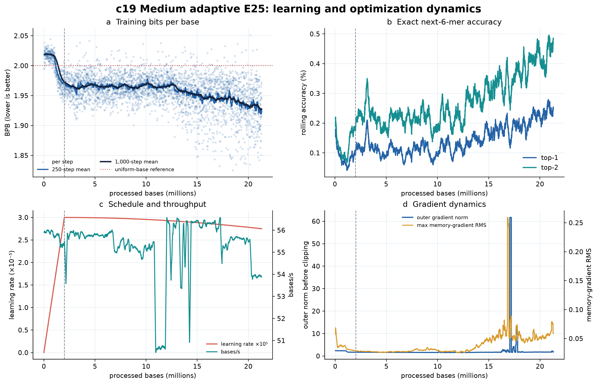
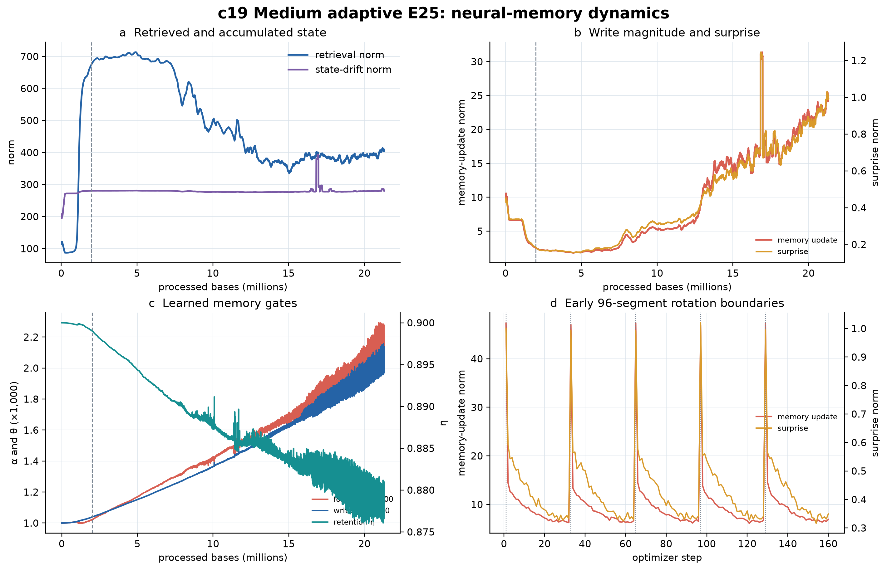

# C19 cumulative engineering and scientific review — 8 August 2026

Snapshot boundary: 8 August 2026, 23:01 MDT (9 August 05:01 UTC)  
Latest training record: optimizer step 36,979; 21,299,904 processed bases

## Bottom line

C19 remains operationally healthy and its training objective is improving more
convincingly than in either prior cumulative review. The deduplicated history now
contains 36,979 finite optimizer-step records and covers 21,299,904 bases, or
81.725% of the fixed 26,062,903-base E25 panel. It has accumulated 107.11 hours
of recorded step time. At the recent mean throughput, approximately 4.763 million
bases and 24.54 GPU-hours remain.

The latest 500-step mean is **1.92380 bits per base (BPB)**. This is 0.02670 BPB
lower than the 6 August boundary and 0.09560 BPB lower than the first 500 steps.
The best 500-step mean is 1.92125 and ends at step 36,809, close to the newest
record. The improvement is therefore sustained and recent rather than a single
favorable minibatch.

The neural-memory system is still finite and active, but the cumulative record
now contains rare, severe transients. At step 29,207, raw memory-gradient RMS
reached 45.58, memory-update norm reached 2,010.72, and surprise reached 119.23;
at step 29,613, the outer gradient norm before clipping reached 15,006.91. The
trajectory recovered and subsequently reached its best rolling loss, so this is
not a persistent runaway. It is nevertheless a real numerical-stability event,
not a minor diagnostic detail. The recorded zero intervention fractions are not
evidence that a memory limiter controlled these events: the checkpoint records
the optional memory-gradient and surprise limits as `null`.

The scientific status remains incomplete. Training loss is not held-out loss;
the step-26,250 generation smoke was operationally successful but poorly
calibrated; and the first step-32,000 context-anomaly/needle attempt stopped in
case construction because of an evaluator defect. That defect has been fixed,
but it produced no scientific context or needle result. On current evidence,
**continue C19 to E25, rerun the corrected checkpoint-indexed evaluations, and
do not authorize E100 yet.**





## Cumulative facts

| Item | 5 Aug | 6 Aug | Current | Meaning |
|---|---:|---:|---:|---|
| Optimizer step | 19,828 | 25,550 | **36,979** | Continuous cumulative history |
| Processed bases | 11,420,928 | 14,716,800 | **21,299,904** | 9.879M bases added since 5 Aug |
| E25 completion | 43.82% | 56.46% | **81.72%** | 4,762,999 bases remain |
| Recorded step time | 57.44 h | 74.17 h | **107.11 h** | Sum of per-step elapsed time |
| Estimated remaining GPU time | 80.30 h | 55.93 h | **24.54 h** | Estimate at recent throughput |
| Latest 500-step BPB | 1.96522 | 1.95050 | **1.92380** | Lower is better; training only |
| Best 500-step BPB | 1.95631 | 1.94921 | **1.92125** | Best window ends at step 36,809 |
| Latest 500-step top-1 accuracy | 0.0771% | 0.1875% | **0.2500%** | Exact next non-overlapping 6-mer |
| Latest 500-step top-2 accuracy | 0.1688% | 0.3375% | **0.4813%** | Exact target among two choices |
| Latest 500-step throughput | 50.65 bases/s | 56.35 bases/s | **53.92 bases/s** | Modest recent slowdown |
| Numeric values finite | yes | yes | **yes** | Basic numerical-health check |
| Memory intervention telemetry | 0 | 0 | **0** | Optional memory limits are configured as `null` |

The live point at step 36,979 is 1.93757 BPB, but single-step values are noisy;
the rolling values above are the appropriate trend summary. The current learning
rate is 2.7498 × 10^-5.

## Evidence timeline

| Boundary | Checkpoint/evidence | What it establishes | What it does not establish |
|---|---|---|---|
| 5 Aug, step 19,828 | 43.82% training snapshot | Stable resume; early learning plateau | Generalization or memory benefit |
| 6 Aug, step 25,550 | 56.46% training snapshot | Renewed rolling-loss improvement | Held-out advantage |
| 7 Aug, step 26,250 | Exploratory generation smoke | Checkpoint loads, decoding is finite, Prodigal completes | Matched superiority to C16 |
| 8 Aug, step 32,000 | Immutable 565 MB checkpoint, SHA `1446212e1893…` | Reusable checkpoint identity and architecture | Current live state or scientific gate |
| 8 Aug MDT, step 36,979 | 81.72% live cumulative history | Strongest training-loss evidence so far | Frozen validation outcome |

The step-32,000 checkpoint has the expected C19 architecture: 12 blocks,
`d_model=256`, eight heads, exact accelerated adaptive memory, 32-token
segments, gradient horizon three, and the fixed non-overlapping 6-mer tokenizer.
Its staging manifest records `code_commit: unknown`; this is a provenance gap
that should be corrected for future immutable snapshots even though the model
configuration and checkpoint SHA are recorded.

## Learning dynamics and scientific meaning

### What is directly observed

- Median BPB improves across the late base windows: 1.95393 at 14–16M,
  1.95069 at 16–18M, 1.94217 at 18–20M, and 1.93355 at 20–21.300M bases.
- The latest rolling top-1 accuracy is about 10.24 times the uniform 1/4096
  exact-6-mer reference. The latest top-2 rate is about 9.86 times the uniform
  2/4096 reference.
- The best rolling loss occurs within 170 steps of the current boundary. There
  is no evidence in this snapshot that optimization has reached a final plateau.
- Outer gradient norm remains finite. The latest 500-step mean is 1.963 before
  the configured global clipping operation.

### Scientific meaning

These observations are strong evidence that the model is learning non-uniform
sequence structure represented in the training panel. The continuing reduction
below the nominal two-bit uniform-base reference is meaningful as a training
objective result, and the late-window monotonic direction is more persuasive
than the nearly flat middle of the trajectory.

They are not yet evidence of generalization. Ordered whole-replicon training can
change sequence composition over time, and different accessions or genomic
regions can differ in intrinsic predictability. Without accession-stratified
held-out BPB, the observed improvement cannot be cleanly divided into learning,
data-order effects, or their interaction. Exact 6-mer accuracy is useful as a
sanity check but remains small in absolute terms; BPB is the more informative
summary because it evaluates the full probability distribution.

## Neural-memory dynamics

| Latest 500-step mean | 6 Aug | Current | Change |
|---|---:|---:|---:|
| Retrieval norm | 366.78 | 406.58 | +10.9% |
| Memory-update norm | 15.21 | 24.32 | +59.9% |
| Surprise norm | 0.583 | 0.991 | +70.0% |
| Raw memory-gradient RMS max | 0.0461 | 0.0687 | +49.1% |
| State-drift norm | 276.91 | 283.06 | +2.2% |
| Mean forget gate `alpha` | 0.001658 | 0.002159 | +30.2% |
| Mean retention gate `eta` | 0.88403 | 0.87907 | -0.56% |
| Mean write gate `theta` | 0.001607 | 0.002037 | +26.7% |

The recent 2,000-step 99th percentiles are 40.80 for memory-update norm, 1.538
for surprise, and 0.1615 for raw memory-gradient RMS. All remain finite, and
both intervention fractions remain exactly zero. Under the same approximate
constant-`alpha` interpretation used in prior reports, the current forgetting
half-life is roughly 321 inner writes, down from about 419 at the 6 August
boundary. The learned policy is therefore becoming more plastic and retaining
individual fast-memory contributions for a shorter effective interval.

After 18M bases, update and surprise remain strongly associated (Pearson
`r=0.877`). Their correlations with BPB are weak (`r=0.066` and `r=0.020`),
while retrieval and BPB are negatively correlated (`r=-0.687`) in that late
slice. These are observational correlations under a changing model and stream;
they do not prove that retrieval causes improved prediction or that stronger
writes are useful.

### Engineering interpretation

### Rare finite excursions

Rolling and median summaries hide several extreme events. Across the cumulative
history, outer gradient norm exceeds 10 on 30 steps and 100 on nine steps. The
largest memory event occurs at step 29,207 (16,823,232 bases): raw memory-gradient
RMS 45.58, update norm 2,010.72, surprise norm 119.23, and outer gradient norm
53.10. The following steps show a decaying update tail. The largest outer
pre-clip norm, 15,006.91, occurs at step 29,613 (17,057,088 bases).

The configured global outer-gradient clip described in the run protocol limits
the optimizer-facing update, and the model recovered to normal recent medians
(raw RMS 0.0537, update 24.43, surprise 0.956). This recovery and the continued
BPB improvement argue against persistent runaway state. Still, because
`memory_max_gradient_rms`, `memory_max_gradient_rms_ratio`, and
`memory_surprise_clip_norm` are all `null`, the zero intervention fractions are
expected rather than a passed safety test. Future protocols should explicitly
predeclare alert or conditioning thresholds and record stream/accession identity
for each excursion. For this frozen run, investigate and preserve the events;
do not silently alter the configuration near completion.

## Generation evidence, cumulatively

The step-26,250 03p smoke remains the only completed C19 generation assessment.
It loaded the checkpoint, generated all requested continuations, emitted finite
metrics with no ambiguous bases, exposed active neural-memory telemetry, and
completed Prodigal. Operationally, that was a pass.

Scientifically, it remains a calibration warning:

| Temperature | 6-mer JSD ↓ | Aligned 6-mer diversity/reference | GC error ↓ |
|---:|---:|---:|---:|
| 0.6 | 0.4599 | 0.451 | 0.1077 |
| 0.8 | 0.4413 | 0.503 | 0.0884 |
| 1.0 | 0.4322 | 0.451 | 0.0814 |

The output was too GC-rich, locally under-diverse, and over-called as coding by
Prodigal. It improved homopolymer behavior relative to the supplied C16 sample,
but the C16/C19 protocols were not matched. This evidence cannot pass or fail
the frozen E25 generation gate and cannot establish biological function,
expression, viability, fitness, or safety.

## Context-anomaly and needle evidence

The step-32,000 checkpoint was staged immutably and the 03q evaluator passed its
checkpoint and dataset checks. The smoke then stopped before model scoring while
constructing cross-ANI cases. The cause was an evaluator bookkeeping/search
defect: a host identity could be counted before its complete 1/4-segment GC-
matched grid was valid. The corrected selector now searches all donor starts
against every requested length and accepts a pair only after the complete grid
passes.

This failure is **not evidence for or against C19 memory or anomaly detection**.
There are no AUPRC, fixed-FPR, recovery, or needle-recall results yet. The
corrected smoke must be rerun. Treating an infrastructure/case-construction
failure as a negative model result would be scientifically incorrect.

## Facts, interpretations, and open claims

| Statement | Classification | Confidence |
|---|---|---|
| C19 reached step 36,979 and 21,299,904 bases | Measured fact | High |
| The current history is finite and continuous after deduplication | Measured fact | High |
| Recent training BPB is substantially lower than on 5–6 August | Measured fact | High |
| C19 learns non-uniform training-panel DNA statistics | Supported interpretation | High |
| Fast memory is active and its learned policy is becoming more plastic | Supported interpretation from telemetry | Moderate |
| Adaptive memory causes the loss improvement | Open causal claim | Not established |
| C19 generalizes better than C16 | Open comparative claim | Not established |
| C19 has mature generation capability | Contradicted by current smoke calibration | Low support |
| The 03q failure indicates a weak model | Incorrect inference | No support |
| C19 should scale to E100 now | Decision claim | Not supported yet |

## Scientific opinion

My opinion is **cautiously but materially more positive about learning, but more
concerned about numerical robustness than on 6 August**. The
central reason is not simply that BPB is lower; it is that the best rolling
window continues to move with the training frontier and the late 2M-base windows
show progressively better medians. C19 is still learning at 82% of E25 rather
than merely consuming compute on a flat objective. The run is sufficiently
stable and scientifically interesting to finish.

I do not consider the memory telemetry benign by default. The run experienced
genuine finite gradient/memory excursions, even though it did not become
non-finite or suffer a sustained loss reversal. That makes the corrected
carried/reset/wrong-host/no-memory tests especially important. If carried memory
improves anomaly or needle scores while wrong-host state hurts them in the
expected direction, the rising plasticity becomes a plausible useful mechanism.
If those causal contrasts are absent, the same telemetry may represent expensive
and occasionally hazardous state activity without useful long-context behavior.

I would not authorize E100 today. The remaining roughly one-GPU-day compute to
finish E25 is justified, but scaling before frozen held-out evaluation would
confuse promising optimization with demonstrated scientific value. The proper
decision boundary is after E25 plus the corrected context/needle smoke, the
accession-balanced held-out comparison, and a matched C16/C19 generation run.

## Recommended actions

1. Finish the remaining 4.763M E25 bases while retaining the current exact
   paper-memory configuration, but monitor every checkpoint and stop on any
   non-finite value, persistent loss degradation, or unrecovered excursion.
2. Rerun corrected 03q smoke on the immutable step-32,000 checkpoint now; do not
   wait for E25 to verify the evaluation pipeline.
3. Stage the final E25 checkpoint with normalized dataset/component fingerprints
   and a non-`unknown` code commit.
4. Run the frozen accession-balanced held-out BPB comparison with paired host
   bootstrap intervals.
5. Run full 03q validation, then the explicitly locked test only if validation
   completes; preserve carried/reset/wrong-host/no-memory contrasts.
6. Repeat generation under a protocol exactly matched to the frozen C16 report.
7. Decide E100 only from the combined held-out, causal-memory, and matched-
   generation evidence—not from training telemetry alone.
8. Before any second seed or E100 run, preregister memory-gradient/surprise
   alerting or conditioning policy and add accession/stream IDs to telemetry so
   the step-29,207 and step-29,613 events can be traced to sequence context.

## Reproducibility

The machine-readable snapshot is [c19_snapshot_summary.json](c19_snapshot_summary.json),
the cross-review timeline is [c19_cumulative_state.json](c19_cumulative_state.json),
and source identities are in [SOURCE_MANIFEST.json](SOURCE_MANIFEST.json). The
plots and snapshot summary were generated with:

```bash
.venv/bin/python docs/titans_stage_c/analyze_c19_training_snapshot.py \
  --history /path/to/training_history.csv \
  --live-status /path/to/LIVE_STATUS.json \
  --output-dir artifacts/stage_c_c19_review_20260808_cumulative
```

The training history itself is not duplicated in this compact report bundle;
its Drive file ID and SHA-256 are recorded in the source manifest.
