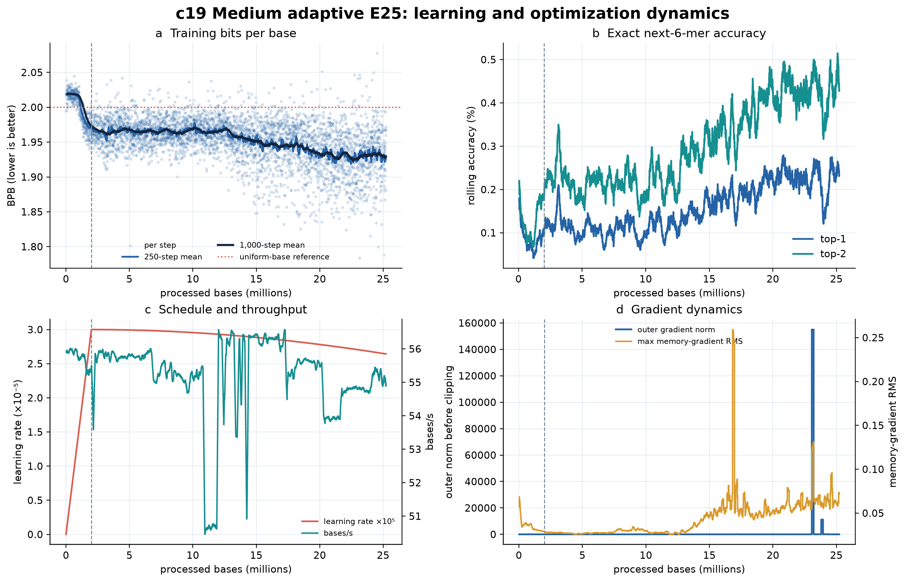
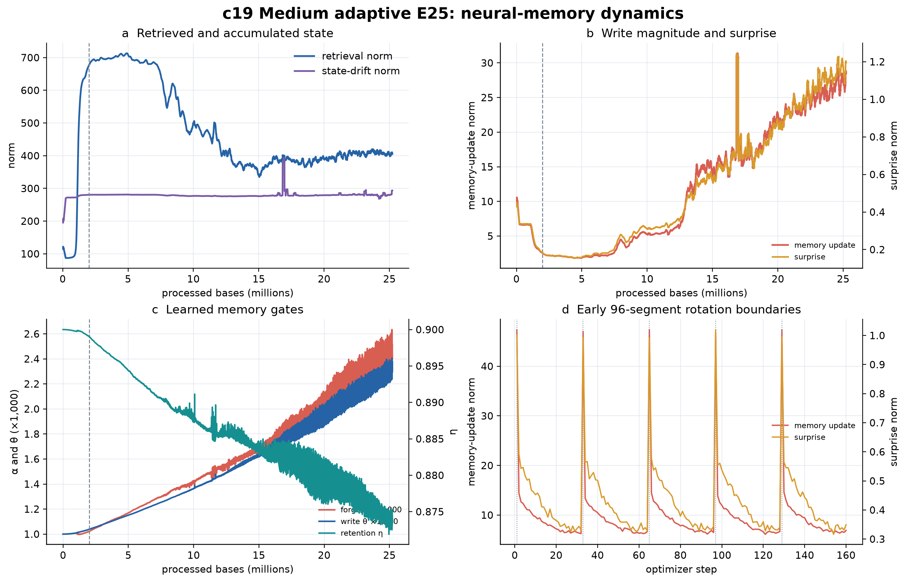

# C19 cumulative engineering and scientific review — 11 August 2026

Snapshot boundary: 11 August 2026, 00:09 MDT (06:09 UTC)  
Latest synchronized history: optimizer step 43,783; 25,217,968 processed bases  
Live status: optimizer step 43,784; 25,218,544 processed bases

## Bottom line

C19 is still running, finite, and very close to completing E25. The live status
covers **96.760%** of the fixed 26,062,903-base panel, leaving 844,359 bases.
At the recent 55.03 bases/s mean, approximately **4.27 A100-hours remain**. The
deduplicated history contains 43,783 finite records and 126.97 hours of recorded
step time.

The learning result is now more mixed than at the 8 August boundary. The latest
500-step mean is **1.92873 BPB**, still 0.09067 BPB below the first 500 steps but
0.00493 BPB worse than on 8 August. The best 500-step mean improved marginally
to 1.92103 and ends at step 39,255 (22.611M bases), more than 4,500 steps behind
the current frontier. Median BPB was 1.93072 from 22–24M bases and 1.93330 from
24M to the snapshot. This looks like a mild late plateau or rebound, not a
continuing monotonic improvement. Ordered-stream composition remains a possible
contributor; only held-out evaluation can distinguish generalization from
training-order effects.

The principal new engineering result is serious. At step 40,035, the recorded
outer gradient norm before clipping reached **38,741,872**, raw memory-gradient
RMS reached 15.68, written-state gradient norm reached 49,813, memory update
reached 308.35, and surprise reached 23.70. All values remained finite. The
following step's outer gradient norm was 2.23 and subsequent training continued
normally, so the event was transient rather than a persistent runaway. However,
it is far larger than the already concerning excursions in the 8 August report
and cannot be called benign merely because the configured outer clip allowed the
trajectory to survive.

My recommendation is: **finish the final 3.24% without changing the frozen C19
configuration, preserve the final checkpoint immediately, and do not authorize
E100 until the complete held-out, generation, context/anomaly, memory-behavior,
resume, architecture, and numerical-stability review has passed.**

## Cumulative facts

| Item | 5 Aug | 6 Aug | 8 Aug | Current | Meaning |
|---|---:|---:|---:|---:|---|
| Optimizer step | 19,828 | 25,550 | 36,979 | **43,783** | Deduplicated synchronized history |
| Processed bases | 11,420,928 | 14,716,800 | 21,299,904 | **25,217,968** | CSV is one step behind live status |
| E25 completion | 43.82% | 56.46% | 81.72% | **96.76%** | 844,359 live-status bases remain |
| Recorded step time | 57.44 h | 74.17 h | 107.11 h | **126.97 h** | Sum of per-step elapsed time |
| Estimated remaining GPU time | 80.30 h | 55.93 h | 24.54 h | **4.27 h** | Estimate at recent throughput |
| Latest 500-step BPB | 1.96522 | 1.95050 | 1.92380 | **1.92873** | Training only; lower is better |
| Best 500-step BPB | 1.95631 | 1.94921 | 1.92125 | **1.92103** | Best window ends at step 39,255 |
| Latest 500-step top-1 | 0.0771% | 0.1875% | 0.2500% | **0.2313%** | Exact next non-overlapping 6-mer |
| Latest 500-step top-2 | 0.1688% | 0.3375% | 0.4813% | **0.4292%** | Exact target among two choices |
| Recent throughput | 50.65 | 56.35 | 53.92 | **55.03 bases/s** | Stable recent throughput |
| Numeric values finite | yes | yes | yes | **yes** | Necessary but not sufficient stability check |
| Memory intervention telemetry | 0 | 0 | 0 | **0** | Relevant optional limits remain `null` |

Since the 8 August boundary, C19 added 6,804 synchronized optimizer steps,
3,918,064 bases, and 19.85 hours of recorded step time. The live point at step
43,784 is 1.92853 BPB. Single-step values remain too noisy for model selection.
The latest synchronized learning rate is 2.6430 × 10^-5.

## Evidence timeline

| Boundary | Checkpoint/evidence | What it establishes | What it does not establish |
|---|---|---|---|
| 5 Aug, step 19,828 | 43.82% cumulative snapshot | Stable resume and early learning | Generalization or memory benefit |
| 6 Aug, step 25,550 | 56.46% cumulative snapshot | Renewed rolling-loss improvement | Held-out advantage |
| 7 Aug, step 26,250 | Generation smoke | Finite loading and decoding; Prodigal completes | Matched generative superiority |
| 8 Aug, step 32,000 | Immutable checkpoint, SHA `1446212e1893…` | Reusable architecture/checkpoint identity | Current state or a passed scientific gate |
| 8 Aug, step 36,979 | 81.72% cumulative snapshot | Best frontier-relative learning evidence at that boundary | E25 completion or generalization |
| 9–10 Aug | Interrupted Colab wrapper sessions | Resume artifacts survived ordinary session interruption | Failure of the authoritative training trajectory |
| 11 Aug, step 43,783/43,784 | 96.76% live cumulative snapshot | Near-complete finite run; new extreme gradient evidence | Held-out quality, causal memory utility, or E100 authorization |

The current `colab_run_manifest.json` identifies the expected training commit
`ae72fae21ff9a0b50e4fe1d9d642c38c643b4923`, an NVIDIA A100-SXM4-40GB,
Python 3.12.13, PyTorch 2.11.0+cu128, batch size one, BF16 attention, seed
20260751, twelve blocks, `d_model=256`, eight heads, depth-two paper-exact
adaptive memory, gradient horizon three, and 96-segment stateful rotation.

`FAILED.txt` records an earlier wrapper return code, but it is not the current
run state. The wrapper manifest records subsequent invocations, and both the
latest wrapper entry and `LIVE_STATUS.json` say training is running. This is an
operational interruption/resume history, not evidence that the current
authoritative checkpoint failed.

## Learning dynamics

### Direct observations

- The first 500 steps average 2.01940 BPB; the latest 500 average 1.92873 BPB.
  C19 has clearly learned training-panel sequence statistics.
- The best 500-step mean is 1.92103 and ends at 22.611M processed bases.
- Median BPB improves across 18–20M (1.94217), 20–22M (1.93449), and 22–24M
  (1.93072), then rises slightly over 24–25.218M (1.93330).
- The latest 500-step median is 1.93138 BPB. The latest top-1 and top-2 exact
  6-mer rates remain above uniform references but are slightly below the
  8 August rolling values.
- The current training frontier has not produced a new best rolling window for
  roughly 4,528 optimizer steps.

### Interpretation

The sustained reduction from the start of training strongly supports learning
of non-uniform E. coli sequence statistics. The newest evidence no longer
supports the stronger statement that training quality is improving steadily at
the frontier. A late plateau is plausible, but ordered complete-replicon
rotation means the final data slice may also differ in intrinsic predictability.

Training BPB cannot adjudicate the frozen E25 prediction gate. The required
result is accession-balanced held-out BPB versus c16, including the paired
bootstrap interval and fraction of accessions improved. No such completed result
is present in this evidence bundle.

## Numerical stability and finite excursions

### New step-40,035 event

| Quantity | Step 40,034 | Step 40,035 | Step 40,036 |
|---|---:|---:|---:|
| Training BPB | 1.98501 | **1.95280** | 1.96562 |
| Outer gradient norm | 1.62 | **38,741,872** | 2.23 |
| Raw memory-gradient RMS max | 0.039 | **15.681** | 0.294 |
| Memory-update norm | 22.44 | **308.35** | 42.33 |
| Surprise norm | 0.999 | **23.697** | 1.072 |
| Written-state gradient norm | 67.55 | **49,813.19** | 86.69 |

The loss did not become non-finite, and the ordinary-scale next step is strong
evidence of immediate recovery. The configured outer gradient clip norm is 0.5,
so the reported pre-clip magnitude is not the optimizer-facing update magnitude.
Nevertheless, a pre-clip norm near 3.9 × 10^7 exposes a severe local conditioning
problem. It should be traced to its accession, stream, segment, and memory state
before committing hundreds of additional E100 GPU-hours.

Across the full history, outer gradient norm now exceeds 10 on 82 steps and 100
on 24 steps, versus 30 and nine at the 8 August boundary. Fifty-two >10 events
and fifteen >100 events are new. A second post-boundary event reached 2.78 ×
10^6 at step 41,318. The largest raw memory-gradient event remains step 29,207
(45.58 RMS, 2,010.72 update norm, 119.23 surprise).

The newest 2,000-step 99th percentiles are 49.14 for memory-update norm, 1.846
for surprise, 0.299 for raw memory-gradient RMS, and 7.85 for outer gradient
norm. These tails are higher than on 8 August even though ordinary recent
medians remain moderate.

Neither `memory_max_gradient_rms`, `memory_max_gradient_rms_ratio`, nor
`memory_surprise_clip_norm` is configured. The intervention fractions therefore
remain zero by construction; zero is not evidence that a safety limiter passed.
Do not introduce a new limiter during the final 3.24%, because that would change
the frozen scientific condition. Treat the excursions as explicit evidence in
the E100 allocation decision.

## Neural-memory dynamics

| Latest 500-step mean | 8 Aug | Current | Change |
|---|---:|---:|---:|
| Retrieval norm | 406.58 | **404.26** | -0.6% |
| Memory-update norm | 24.32 | **27.80** | +14.3% |
| Surprise norm | 0.991 | **1.161** | +17.1% |
| Raw memory-gradient RMS max | 0.0687 | **0.0666** | -3.1% |
| State-drift norm | 283.06 | **287.24** | +1.5% |
| Mean forget gate `alpha` | 0.002159 | **0.002435** | +12.8% |
| Mean retention gate `eta` | 0.87907 | **0.87401** | -0.6% |
| Mean write gate `theta` | 0.002037 | **0.002301** | +13.0% |

The ordinary-state memory system remains active. Using the same approximate
constant-`alpha` interpretation as earlier reviews, the latest mean implies a
forgetting half-life of roughly 284 inner writes, down from about 321 on 8
August. The learned memory is becoming more plastic: writes and surprise are
larger, retention is slightly lower, and individual contributions decay faster.

After 18M bases, update and surprise remain strongly associated (`r=0.834`).
Their correlations with BPB remain weak (`r=0.098` and `r=0.076`), while
retrieval norm and BPB remain negatively associated (`r=-0.624`). These are
observational correlations under changing weights, state, and sequence order.
They do not prove that memory causes better prediction.

## Generation, context, and held-out evidence

The step-26,250 generation smoke remains the only completed C19 generation
assessment in the available evidence. It was operationally successful but
scientifically poorly calibrated: generated sequences were too GC-rich,
under-diverse at aligned 6-mers, and over-called as coding by Prodigal. Its
protocol was not a matched frozen c16/C19 comparison.

The previous step-32,000 context/anomaly and DNA-needle attempt stopped during
case construction because of a corrected evaluator defect. No AUPRC,
fixed-FPR, recovery, or needle-recall result is available here. Infrastructure
failure is neither positive nor negative model evidence.

No completed accession-balanced held-out prediction gate, final architecture
report, final resume verification, or panel-exhaustion manifest is present at
this snapshot. E25 is therefore nearly complete operationally but incomplete
scientifically.

## Facts, interpretations, and open claims

| Statement | Classification | Confidence |
|---|---|---|
| C19 reached live step 43,784 and 25,218,544 bases | Measured fact | High |
| All synchronized numeric history values are finite | Measured fact | High |
| Training BPB is substantially below its early-run value | Measured fact | High |
| The newest frontier shows mild plateau/rebound behavior | Supported interpretation | Moderate |
| The step-40,035 event is a severe finite conditioning event | Supported interpretation | High |
| The configured outer clip allowed the trajectory to continue | Supported engineering interpretation | High |
| Adaptive memory causes the learned improvement | Open causal claim | Not established |
| C19 generalizes better than c16 | Open comparative claim | Not established |
| C19 has mature generative or anomaly capability | Open claim | Not established |
| C19 should scale to E100 immediately | Decision claim | Not supported yet |

## Scientific opinion

My opinion is **finish E25, but enter the post-E25 gate with more numerical
caution than on 8 August**. The case for finishing is strong: only 3.24% and
roughly 4.3 A100-hours remain, the run is finite, the step-40,035 event recovered
immediately, and altering the configuration now would compromise the frozen
trajectory. The case for automatic E100 continuation is weak: frontier loss has
not improved for thousands of steps, held-out evidence is absent, and the new
gradient event is orders of magnitude larger than previously observed.

A passed held-out gate would show that the model is useful despite this
optimization behavior; it would not erase the engineering risk. Before E100,
the allocation review should explicitly decide whether the extreme events are
acceptable under checkpointing and monitoring, whether the offending streams
share a reproducible feature, and whether a prospectively declared future
protocol needs conditioning thresholds. No threshold should be invented
post hoc to retroactively relabel C19.

## Recommended actions

1. Finish the remaining 844,359 bases with the exact frozen configuration.
2. Monitor every remaining checkpoint; stop on non-finite state, checksum
   failure, checkpoint regression, or scientific configuration drift.
3. Immediately archive the panel-exhausted final checkpoint, history, logs,
   `run_manifest.json`, `LIVE_STATUS.json`, architecture report, and exact-resume
   verification with SHA-256 identities.
4. Identify the accession, stream, coordinate, and scheduler/memory state at
   steps 40,035, 41,318, 41,713, 42,556, 42,637, and 43,709. Preserve this as a
   numerical-stability appendix rather than filtering the rows from plots.
5. Run notebook 03m's complete accession-balanced held-out E25 gate.
6. Rerun the corrected context/anomaly and DNA-needle evaluation on an immutable
   final checkpoint.
7. Run a matched c16/C19 generation comparison and the controlled immediate and
   delayed memory-association tests.
8. Do not start E100, the GCP no-memory control, or the second seed until the
   predeclared E25 gate says proceed. If it passes, carry this report's numerical
   warning into the CURC/GCP preflight and monitoring contract.

## Scope and limitations

- This is a time-stamped cumulative training review, not the E25 scientific
  gate report.
- Training BPB can reflect learning, ordered stream composition, or both.
- Memory telemetry establishes activity and finite state, not usefulness.
- The current latest checkpoint was not downloaded for this report; checkpoint
  conclusions use prior immutable evidence plus current telemetry and runtime
  provenance.
- `LIVE_STATUS.json` is one step ahead of `training_history.csv`; both values
  are reported rather than silently reconciling them.
- Generated ORFs, motifs, codon patterns, and anomaly scores are statistical
  diagnostics, not claims of biological function, expression, viability,
  pathogenicity, or safety.

Source identities and synchronization notes are recorded in
`SOURCE_MANIFEST.json`; machine-readable conclusions are in
`c19_cumulative_state.json` and the plot input summary is in
`c19_snapshot_summary.json`.
