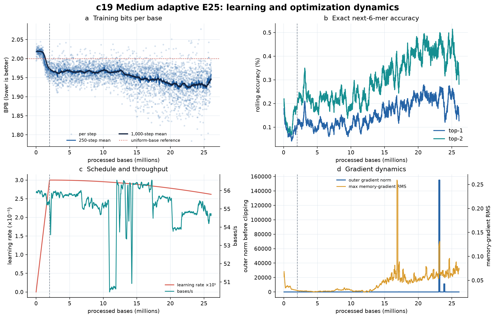
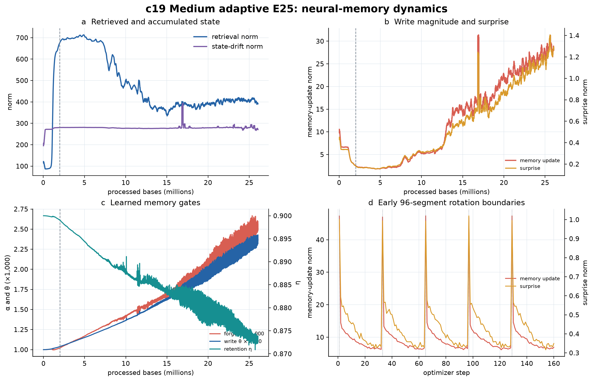

# C19 final E25 training review — 11 August 2026

Evidence boundary: final Drive state retrieved at 10:07 MDT. Training completed at 06:49 MDT (12:49 UTC).

## Decision

**C19 finished E25 successfully, but E100 is not yet authorized. Hold the E100 launch.**

The training requirement itself passed: C19 consumed exactly 26,062,903 predictable bases, completed one declared corpus pass in 45,252 optimizer steps, exhausted the fixed E25 scheduler, and wrote a final checkpoint. The training command returned zero and the architecture export passed. The final checkpoint SHA-256 is `07fb2069b1f29a76898a90d8dfb899c5ca46cb90608fac45bc0ddff9876dbd1a`.

What has not passed is the complete E25 scientific and operational gate. The terminal exact-resume check failed, the broad accession-balanced held-out comparison has not run, and the final-checkpoint memory, matched-generation, and context/anomaly tests are absent. The frozen protocol explicitly says failed or missing gates stop the next allocation. Notebook 03n also requires `scale_analysis_v1/gate/scale_gate.json` with `proceed=true`; that artifact is not present.

This is therefore a successful completed training run and a scientifically promising engineering milestone—not yet a positive E25 scale decision.

## What happened

| Result | Final observation | Assessment |
|---|---:|---|
| Panel completion | 26,062,903 / 26,062,903 bases | Pass |
| Optimizer steps | 45,252 | Complete |
| Corpus passes | 1.000 | Complete |
| Stop reason | `panel_exhausted` | Correct |
| Recorded training-step time | 131.27 A100-hours | Descriptive, not billing time |
| Mean throughput | 55.15 bases/s | Stable |
| Numeric history | All finite | Necessary stability pass |
| Training wrapper | Final invocation returned 0 | Pass |
| Architecture export | Returned 0 | Pass |
| Resume verifier | Returned 1 | Unresolved blocker |

Training ran from 2–11 August through multiple Colab wrapper invocations. Most boundaries are recorded as interrupted because a new invocation began before the prior wrapper finalized; the durable checkpoint and scheduler state allowed the authoritative trajectory to continue. Two earlier training invocations returned nonzero, but later invocations resumed and the final training invocation passed. This is strong practical evidence that checkpoint recovery worked during the run.

The model is the declared 24,787,200-parameter Medium configuration: 12 blocks, width 256, eight attention heads, four persistent tokens, depth-two `paper_residual_mlp_v2` memory, exact recurrence, gradient horizon three, BF16 attention, and FP32 functional memory. The architecture export reports approximately 50.6 MB of functional state per active stream.

The final `run_manifest.json` records `code_commit: unknown`, while the independent Colab environment manifest records the clean frozen training commit `ae72fae21ff9a0b50e4fe1d9d642c38c643b4923`. The environment record preserves the intended provenance, but the missing commit inside the checkpoint/run manifest should be corrected prospectively.

## Training dynamics

The first 500 steps averaged 2.01940 bits per base (BPB). The best 500-step window averaged 1.92103 BPB and ended at step 39,255, after 22.611 million bases. The final 500 steps averaged 1.95146 BPB. Relative to the first window, the final window improved 3.36%, while the best window improved 4.87%.

This supports a clear but bounded conclusion: C19 learned non-uniform E. coli sequence statistics. It does not support a claim that learning improved monotonically until panel exhaustion. The best rolling window was 5,997 steps before the end. Median BPB moved from 1.93072 over 22–24 million bases to 1.93781 over 24–26 million bases, and the short final slice had median 1.96621. The last 2,000-step linear trend was upward by about 0.028 BPB per million bases.

The likely explanations are a late optimization plateau, changing difficulty as ordered replicons rotate through the scheduler, or both. Training telemetry alone cannot separate those explanations. The absence of a new best window in the last 13.3% of steps argues against spending E100 compute solely because the training curve was still improving.

Exact next-6-mer accuracy is low in absolute terms: the final 500-step top-1 mean was 0.127% and top-2 was 0.281%. These values are above a uniform 4,096-way six-mer guess, but they are not an intuitive biological-quality score. BPB is the more interpretable training objective.

## Terminal validation diagnostic

The training command ran its built-in validation on 512 segments from one accession, `GCF_000351405.1`, covering 46,924 valid bases. It obtained 2.42743 BPB, versus 1.95146 for the final 500 training steps—a 0.47597 BPB or 24.4% gap.

That result is concerning. It is above the 2-BPB uniform independent-base reference and well above the frozen E25 target of median held-out accession BPB no greater than 1.96. It suggests overfitting, distribution shift, poor calibration on this accession, or an unfavorable combination of those effects.

It is not, however, an admissible failure of the preregistered prediction gate. It covers only one accession and a bounded 512-segment sample. The actual gate requires a broad panel, per-accession results, comparison with the frozen c16 baseline, a paired-accession bootstrap interval, and at least 75% of accessions improving. None of those comparative statistics exists yet. The correct label is **red flag requiring immediate broad evaluation**, not **scientific gate result**.

## Numerical stability

All 45,252 synchronized history rows are finite, and the configured outer gradient clip of 0.5 allowed training to recover from every recorded excursion. Ordinary behavior remained much smaller than the extremes: in the final 1,000 steps, the median outer pre-clip gradient was 1.681 and the 95th percentile was 2.336.

The tail is nevertheless severe:

| Event | Step | Bases | Magnitude | Related memory behavior |
|---|---:|---:|---:|---|
| Largest outer gradient | 40,035 | 23,060,087 | 38,741,872 | Memory-gradient RMS 15.68; update 308.35; surprise 23.70 |
| Second-largest outer gradient | 41,318 | 23,799,065 | 2,784,913 | Memory-gradient RMS 1.07; update 69.84; surprise 6.20 |
| Largest memory event | 29,207 | 16,823,232 | Update norm 2,010.72 | Memory-gradient RMS 45.58; surprise 119.23 |
| Late large event | 44,304 | 25,517,974 | Outer gradient 5,358.74 | Update 234.49; surprise 13.17 |
| Final-region event | 45,061 | 25,953,348 | Outer gradient 1,116.08 | Update 85.50; surprise 5.71 |

Across the run, the outer pre-clip norm exceeded 10 on 110 steps, 100 on 31 steps, 1,000 on 11 steps, and one million on two steps. The loss stayed finite and ordinary-scale behavior returned after the major events, so this was not a persistent numerical runaway. But the distribution is heavy-tailed, and the last 0.55 million bases added further four-digit events. Calling the run simply “stable” would hide relevant engineering risk.

No memory-gradient RMS limit, memory-gradient ratio limit, or surprise clip was configured. The zero intervention fractions therefore mean no limiter was active; they do not prove that a safety mechanism was tested. Do not retroactively change C19 or its interpretation. For E100, any new threshold must be declared prospectively and its scientific effect separated from the E25 condition.

## Neural-memory behavior

The memory system was not inert. Between the first and final 500-step windows:

| Quantity | First 500 | Final 500 | Direction |
|---|---:|---:|---|
| Forget gate `alpha` | 0.001000 | 0.002505 | 2.50× larger |
| Retention gate `eta` | 0.89999 | 0.87309 | Lower retention |
| Write gate `theta` | 0.001000 | 0.002359 | 2.36× larger |
| Memory-update norm | — | 27.69 | Active writes |
| Surprise norm | — | 1.244 | Active signal |
| Retrieval norm | — | 391.65 | Active retrieval |

Under the same constant-`alpha` approximation used in prior reviews, the forgetting half-life shortened from roughly 693 to 276 inner writes. The model therefore learned a more plastic memory regime: stronger writing, faster forgetting, and slightly lower retention.

After 18 million bases, update and surprise remained strongly associated (`r=0.834`), but update versus BPB (`r=0.121`) and surprise versus BPB (`r=0.108`) were weak. Retrieval norm and BPB were negatively associated (`r=-0.606`). These are observational correlations under changing weights, stream composition, and state. They establish activity, not causal usefulness. The frozen controlled-association test is still required.

## Resume-verification failure

The notebook failed after successful training and architecture export. The verifier loaded the final checkpoint, reconstructed the E25 scheduler, and demanded exactly one additional optimizer step. Because the saved scheduler was already exhausted, training correctly executed zero additional steps, and the verifier raised:

> deterministic continuation did not execute exactly one optimizer step

This is consistent with a terminal-checkpoint edge condition in the verifier. It is not evidence that the checkpoint is corrupt, but neither should it be waved through. The frozen qualification says exact resume must pass, and the runbook requires the final cell to pass.

Resolve this without modifying the final checkpoint. Acceptable evidence would be a corrected terminal-state verifier that proves scheduler exhaustion and checkpoint immutability, plus a deterministic continuation test from an immutable pre-exhaustion checkpoint. Preserve the existing failed log as part of the audit trail.

## Scientific relevance

C19 materially advances the project in four ways.

First, it demonstrates that the 12-block, 24.8-million-parameter paper-exact adaptive-memory model can complete an accession-balanced, whole-replicon E25 exposure on an A100 while preserving finite state across many interruptions. This is substantially stronger operational evidence than the compact c16 experiment.

Second, it shows that the model learns local genomic sequence structure below the 2-BPB reference during training. The improvement is real within the observed trajectory, although modest and not monotonic at the end.

Third, it exposes the engineering behavior that scaling would amplify: roughly 50.6 MB of functional state per stream, increasing memory plasticity, and rare but enormous pre-clip gradient and memory events. These observations are valuable even if the scientific scale gate ultimately fails because they define what future monitoring and conditioning studies must address.

Fourth, it clarifies the current boundary of evidence. C19 does not yet demonstrate broad held-out generalization, adaptive-memory superiority, mature DNA generation, anomaly detection, taxonomic representation, or biological function. The earlier step-26,250 generation smoke was finite and less repetitive than c16, but remained GC-rich, under-diverse, over-called as coding, and unmatched in protocol. The corrected context/anomaly run produced no completed scientific endpoint. Those limitations remain unchanged by completing training.

## E100 gate audit

| Frozen requirement before E100 | Current state | Decision effect |
|---|---|---|
| E25 panel exhausted with immutable checkpoint | Passed | Supports evaluation |
| Exact resume passes | Failed at terminal boundary | Blocks automatic progression |
| Median held-out accession BPB ≤ 1.96 | Not measured on broad panel | Blocks progression |
| At least 0.02 BPB better than broad c16 baseline | Not measured | Blocks progression |
| Paired-bootstrap upper 95% bound below zero | Not measured | Blocks progression |
| At least 75% of accessions improve | Not measured | Blocks progression |
| Immediate and delayed memory benefit in ≥10/12 blocks | Not measured on final checkpoint | Blocks progression |
| Matched generation diversity/JSD/GC gate | Not measured; earlier unmatched smoke was poor | Blocks progression |
| Final context/anomaly evidence | Not completed | Required for the complete review |
| `scale_gate.json` says `proceed=true` | Missing | Hard launch block |

The terminal one-accession validation diagnostic also points in the wrong direction. Even if the resume-verifier issue is repaired, E100 should not start unless the broad 03m evaluation overturns that concern and the registered gate passes without changing thresholds.

## Recommendation and next actions

The recommendation is **HOLD, then evaluate**—not abandon C19, and not launch E100 yet.

1. Archive the final checkpoint, current manifests, history, logs, and hashes. Do not resume or overwrite C19.
2. Repair or supplement terminal resume verification while preserving the failed result. Verify deterministic one-step continuation from a pre-exhaustion checkpoint and terminal exhaustion from the final checkpoint.
3. Run notebook `03m_stage_c_v3_medium_e25_analysis_and_gate.ipynb` against the immutable final checkpoint and frozen c16 broad baseline.
4. Require the full accession-balanced prediction statistics, controlled memory behavior, and matched generation evaluation. Run the corrected context/anomaly and needle evaluation as a separate capability result.
5. Trace the largest numerical events to accession, stream, coordinate, and scheduler state before allocating E100.
6. Proceed to E100 only if the existing frozen `scale_gate.json` records `proceed=true`. If it does, use the declared warm-start E100-minus-E25 design and carry the numerical-event monitoring into the preflight. If it does not, stop and investigate generalization/data coverage or model conditioning rather than spending E100 compute.

The most likely near-term outcome is informative either way: a passing broad gate would show that the alarming one-accession diagnostic was unrepresentative; a failing gate would show that additional training exposure or model scale is not the right next intervention.

## Evidence and limitations

The machine-readable final state is in [c19_final_training_state.json](c19_final_training_state.json), plot inputs and rolling summaries are in [c19_snapshot_summary.json](c19_snapshot_summary.json), and source identities are in [SOURCE_MANIFEST.json](SOURCE_MANIFEST.json). The checkpoint itself was not downloaded for this review; its hash and architecture come from the successful architecture export. Training conclusions use the complete history, while scientific gate conclusions are limited to artifacts actually present at the evidence boundary.
