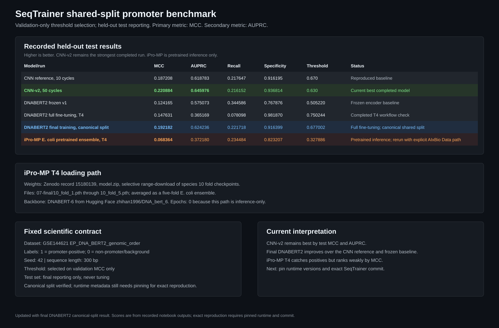

# DNABERT2 Frozen Benchmark

This folder records the **DNABERT2 frozen-encoder benchmark** on the same
benchmark surface used by CNN-v2: predefined GSE144621 splits, seed `42`,
validation-only threshold selection, and held-out test reporting. The notebook
in this folder trains only a small classifier head over cached DNABERT2
embeddings; it does not fine-tune the 117M-parameter encoder.



## Current Result Summary

| Model/run | Test MCC | Test AUPRC | Status |
| --- | ---: | ---: | --- |
| CNN reference | 0.187208 | 0.618783 | Reproduced baseline |
| CNN-v2, 50 cycles | **0.220884** | **0.645976** | Current best recorded model |
| DNABERT2 frozen v1 | 0.124165 | 0.575073 | Reproducible frozen baseline |
| DNABERT2 full fine-tuning, Colab T4 | 0.147631 | 0.365169 | Completed T4 workflow check |
| DNABERT2 final training, canonical split | 0.192182 | 0.624236 | Completed final-training Kaggle/T4 run |
| iPro-MP E. coli pretrained ensemble, Colab T4 | 0.068364 | 0.372180 | Completed pretrained inference check |

Conclusion so far: **CNN-v2 remains the strongest completed run by held-out test MCC and AUPRC**.
The final-training DNABERT2 run used the canonical shared split and improved over
the CNN reference and frozen DNABERT2, but it remains below CNN-v2. The earlier
DNABERT2 T4 result used a different split and is retained only as a historical
workflow check. iPro-MP T4 produced the lowest MCC among recorded runs and should
be rerun with the explicit `AIxBio/Promoter Classification/Data` path.

Open [`assets/RESULTS.md`](assets/RESULTS.md) for the complete metric tables,
training history, model settings, and interpretation.

## iPro-MP T4 Pretrained Inference

The iPro-MP Colab T4 notebook loads the official pretrained E. coli model rather
than training a new model. It uses the selective downloader in
`notebooks/benchmarks_sg/ipromp_benchmark/download_ecoli_weights.py`
to range-download only the five E. coli fold checkpoints from Zenodo record
`15180139`, then downloads the DNABERT-6 backbone from Hugging Face
`zhihan1996/DNA_bert_6`. The five fold probabilities are averaged as an ensemble.
No epochs or learning rate apply to this current iPro-MP path because it is
inference-only.

The completed T4 run selected threshold `0.327886` on validation MCC and reported
test MCC `0.068364`, test AUPRC `0.372180`, recall `0.234484`, and specificity
`0.823207`. Drive inspection verified one accessible `AIxBio` folder with the
canonical nested `Promoter Classification/Data` split files. The notebook audit
printed `/content/drive/MyDrive` and larger row counts, so this is recorded as an
AIxBio T4 inference run but should be rerun with an explicit
`AIxBio/Promoter Classification/Data` path before the final direct same-split
comparison claim.

## T4 Resource Profile

The earlier Colab T4 profile used the following resource settings:

| Setting | Colab T4 profile |
| --- | ---: |
| Maximum epochs | 2 |
| Physical batch size | 2 |
| Gradient accumulation | 16 |
| Effective batch size | 32 |
| Precision | FP16 |
| Early-stopping patience | 1 |
| Gradient checkpointing | Enabled |
| Purpose | Resource-constrained reproducibility run |

The final-training profile is documented separately below because it used a
longer run and a lower learning rate.

## Final-Training DNABERT2 Profile

The final-training notebook and TOML are:

```text
notebooks/final_training/dnabert2-finetune-kaggle.ipynb
notebooks/final_training/config/dnabert2_final_training_t4.toml
```

The run used the canonical files with 136,484 train rows, 19,498 validation
rows, and 38,996 test rows. Its settings were:

| Setting | Final-training value |
| --- | ---: |
| Maximum epochs | 6 |
| Best checkpoint | Validation MCC |
| Early-stopping patience | 2 |
| Physical batch size | 2 |
| Gradient accumulation | 16 |
| Effective batch size | 32 |
| Learning rate | `1e-5` |
| Weight decay | `0.01` |
| Warmup ratio | `0.08` |
| Dropout | `0.20` |
| Precision | FP16 |
| Pooling | Mean pooling |
| Token limit | 104 |
| Seed | 42 |

The best validation MCC occurred at epoch 3, after which validation loss rose
and validation MCC declined. The final test result was MCC `0.192182` and AUPRC
`0.624236`. See [`assets/RESULTS.md`](assets/RESULTS.md) for the complete table.

The archive records the actual runtime as Kaggle with Python 3.12, Torch 2.10.0,
and Transformers 4.41.2, while the TOML describes the intended Colab T4
environment. The split is correct, but the exact runtime and SeqTrainer commit
should be pinned before making a bit-for-bit reproduction claim.

## What Stays Fixed

- Dataset: GSE144621 promoter classification split.
- Split files:
  - `data/promoter_classification/train_EP_DNA_BERT2_genomic_order.csv`
  - `data/promoter_classification/eval_EP_DNA_BERT2_genomic_order.csv`
  - `data/promoter_classification/test_EP_DNA_BERT2_genomic_order.csv`
- Seed: `42`.
- Threshold: selected on validation MCC only.
- Final comparison: held-out test MCC first, held-out test AUPRC second.

## Files

- `dnabert2_shared_split_benchmark_colab.ipynb`: DNABERT2 frozen-encoder Colab
  benchmark with the same Conda-based execution pattern as the original working DNABERT2
  notebook, plus the shared CNN split, validation-only threshold selection,
  complete metric table, training curves, threshold analysis, confusion
  matrices, ROC/PR curves, and optional CNN-v2 comparison.
- `assets/RESULTS.md`: complete recorded result tables and plain-language model,
  data, architecture, optimization, threshold, runtime, and limitation details.
- `../../final_training/dnabert2-finetune-kaggle.ipynb`: final-training full
  fine-tuning notebook used for the canonical-split result.
- `../../final_training/config/dnabert2_final_training_t4.toml`: configuration for
  the final-training profile.
- `assets/cnn_dnabert2_comparison.svg`: readable summary of earlier CNN and
  frozen DNABERT2 scores.

## Why The Frozen Benchmark Exists

The first frozen implementation used a full-dataset classifier update per epoch. That
produced only about 50 optimizer updates and underused the cached embeddings.
The current frozen benchmark trains with mini-batches, early stopping, and validation-only candidate
selection.

The bounded future ablations are:

- BPE token length `70` (official 300 bp reference), `104`, and `128`.
- Mean, CLS, and max pooling.
- Linear and regularized MLP heads.
- Head learning rates `3e-4` and `1e-3`.
- Seeds `42`, `43`, and `44` for future multi-seed confirmation.

The test split is evaluated only after the candidate is selected by validation
MCC, with validation AUPRC as a tie-break.

## Run In Colab

Open:

<https://colab.research.google.com/github/simplyshree/SeqTrainer/blob/issue-3-all-model-baselines/notebooks/benchmarks_sg/dnabert_benchmark/dnabert2_shared_split_benchmark_colab.ipynb>

Use a T4 GPU for an initial workflow check. If the full embedding extraction or
fine-tuning exceeds the free Colab session limit, use a larger runtime without
changing the split, seed, threshold, or metric policy.

Step 1 installs CondaColab and restarts the runtime. After Colab reconnects,
continue from Step 2. The one-sequence preflight must succeed before starting
the full embedding extraction.

## Compare With CNN-v2

After a full DNABERT2 run finishes:

```bash
seqtrainer benchmark compare \
  outputs/benchmarks/cnn_v2_regularized_ep_genomic_order \
  outputs/benchmarks/dnabert2_frozen_ep_genomic_order \
  --output-dir outputs/benchmarks/comparison_cnn_v2_dnabert2
```

## DNABERT Family Plan

Start with DNABERT2, because it is the current benchmark target. DNABERT-6 and
DNABERT-S are separate model-family experiments and should not be mixed into
this DNABERT2 benchmark.

## Scientific References

- Official implementation: <https://github.com/MAGICS-LAB/DNABERT_2>
- Official model card: <https://huggingface.co/zhihan1996/DNABERT-2-117M>
- DNABERT2 paper: <https://arxiv.org/abs/2306.15006>

